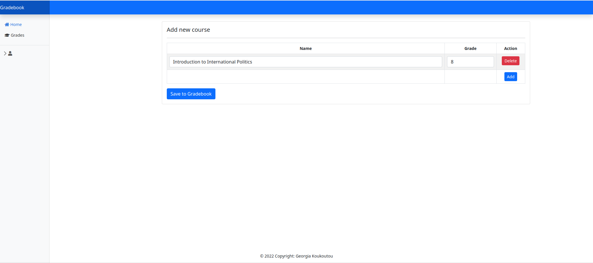

# Gradebook

The project implements a gradebook where users  can create their own accounts, keep track of their completed courses and calculate their current or future GPA based on the grades they are expecting to receive.

The formula used to calculate the GPA is based on my own university's formula but it can easily be modified to fit your needs. 

Technologies used:
- Spring Boot
- MySQL
- Thymeleaf

## How to launch the application

1. Make sure you have Java JDK installed.
2. Clone the code: https://github.com/georgia-koukoutou/gradebook.git
3. Open the application directory with `cd gradebook`
4. Compile the application with `mvn clean package`
4. Run the application using `java -jar target/gradebook.jar `
5. Open http://localhost:8080
6. Enjoy the application!

## Application demo

Register page:

Homepage and add new course option: 

View courses and GPA:

Edit course

Account info:

